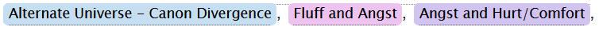

# Ao3 Tag Highlighter

A stylesheet that highlights specific Ao3 tags.
By default it has three sets of color options, but you can add more.

## How to Use

You can use this stylesheet via two methods:

* [Ao3 Site Skin](#siteskins)
* [Stylus](#stylus)

<h3 id="siteskin">Ao3 Site Skins</h3>

1. Head to the [create Site Skin page](https://archiveofourown.org/skins/new?skin_type=Skin).
    * **Note:** If you're not using the default Ao3 skin, due the following:
        1. Scroll down to the Advanced section and open it.
        2. Click `Add parent skin`.
        3. Search for your current skin and add it.
2. Copy and paste the contents of [AO3TagHighlighter.css](AO3TagHighlighter.css) into
the CSS text area.
3. [Customize](#customize) the style.
4. Save!
5. Head to your preferences and change your site skin to the one you just created.

<h3 id="stylus">Stylus</h3>

If you don't have Ao3 account, you're in luck.
Here's the [Stylus](https://add0n.com/stylus.html) version.

Stylus is a browser extension. Once you have it installed, you just have to click on the following image and then `Install Stylus`.

Now, go [customize](#customize) it!

<h3 id="customize">Customizing this Style</h3>

#### Adding Tags

There are three sets of defined tags in the CSS. Each have selectors like so:
`a[href*="Tag"]`.

1. Click on the tag you want to add and then look at the URL.
    * Example: *Fluff and Angst* is `https://archiveofourown.org/tags/Fluff and Angst/works`
2. Copy the part of the url between `tags/` and `/works`. It's usually just the same name
but it can differ.
3. Paste what you copied into the `Tag` spot of the above selector example:
    * Note: If the URL shows spaces, replace the spaces with `%20`
    * Example: `a[href*="Fluff%20and%20Angst"]`

#### Changing Variables

If you're using Stylus:
* While in the extension, you can click the gear icon and change the variables in the popup.

If you're using it as a site skin:
* Look for the block of CSS that's contained within `:root{}`. Those are your variables.
Change the values to your content.
